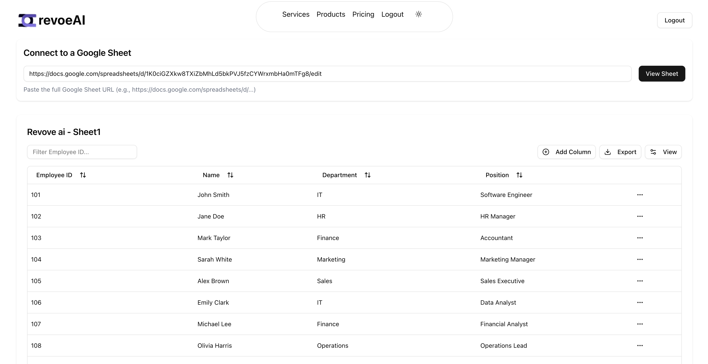

# Google Sheets Dashboard



[**Watch Demo Video**](https://www.loom.com/share/8e942a9477ac4ad1b32d32da5ea49804?sid=70873101-7ace-4474-9152-c5bdcd1997d5)

A fullstack dashboard application that integrates with Google Sheets, built with Next.js and Node.js. This project allows users to create dynamic tables from Google Sheets data and add custom columns to the dashboard display.

## Features

-   **Authentication System**

    -   JWT-based authentication with login and signup
    -   Protected routes for authenticated users
    -   Automatic logout when token expires

-   **Dashboard with Google Sheets Integration**

    -   Create tables from Google Sheets data
    -   Specify column headers and data types
    -   Real-time data synchronization from Google Sheets

-   **Dynamic Column Management**
    -   Add custom columns to the dashboard (not affecting the source Google Sheet)
    -   Support for Text and Date column types
    -   Persistent storage of custom columns

## Tech Stack

### Frontend

-   Next.js 14 (App Router)
-   Tailwind CSS for styling
-   ShadcnUI component library
-   React Context for state management

### Backend

-   Node.js with Express
-   MongoDB for database
-   Prisma as ORM
-   Google Sheets API for integration

## Installation

### Prerequisites

-   Node.js (v18+)
-   MongoDB instance
-   Google Cloud Platform account (for Sheets API)

### Frontend Setup

```bash
# Clone the repository
git clone https://github.com/BhuvanSA/revoeAI.git
cd revoeAI

# Install dependencies
npm install

# Create .env.local file with required variables
touch .env.local
```

Add the following to \`.env.local\`:

```
NEXT_PUBLIC_API_URL=http://localhost:4000/api
NEXT_PUBLIC_APP_URL=http://localhost:3000
```

### Backend Setup

```bash
# Navigate to backend directory
cd backend

# Install dependencies
npm install

# Create .env file
touch .env
```

Add the following to the backend \`.env\` file:

```
DATABASE_URL=mongodb://localhost:27017/dashboard
JWT_SECRET=your_jwt_secret_key
GOOGLE_APPLICATION_CREDENTIALS=./credentials.json
PORT=4000
FRONTEND_URL=http://localhost:3000
```

### Google Sheets API Setup

1. Create a project in Google Cloud Console
2. Enable Google Sheets API
3. Create service account and download credentials

## Running the Application

### Development Mode

```bash

# Run backend
cd backend
npm run dev

# Run frontend (in a separate terminal)
cd frontend
npm run dev
```

Frontend will be available at: http://localhost:3000
Backend will be running at: http://localhost:4000

### Production Build

```bash
# Build frontend
npm run build
npm start

# Build backend
cd backend
npm run build
npm start
```

## API Documentation

### Authentication Endpoints

-   \`POST /api/auth/register\` - Register a new user
-   \`POST /api/auth/login\` - Login and get JWT token
-   \`GET /api/auth/me\` - Get current user details

### Table Endpoints

-   \`POST /api/tables\` - Create a new table
-   \`GET /api/tables\` - Get all tables for current user
-   \`GET /api/tables/:id\` - Get specific table data
-   \`PATCH /api/tables/:id\` - Update table (add columns)
-   \`DELETE /api/tables/:id\` - Delete a table

### Google Sheets Endpoints

-   \`POST /api/sheets/connect\` - Connect to a Google Sheet
-   \`GET /api/sheets/:id/data\` - Get data from connected sheet

## Deployment

This application is deployed with:

-   Frontend: Vercel (https://revoe-ai-iota.vercel.app/)
-   Backend: Render

## Environment Variables for Deployment

### Frontend (Vercel)

-   \`NEXT_PUBLIC_API_URL\`: URL to your deployed backend

### Backend (Render)

-   \`DATABASE_URL\`: MongoDB connection string
-   \`JWT_SECRET\`: Secret for JWT token generation
-   \`GOOGLE_APPLICATION_CREDENTIALS\`: Path to Google credentials
-   \`FRONTEND_URL\`: URL to your deployed frontend

## Code Architecture

### Frontend Structure

-   `app/` - Contains Next.js pages using the App Router
-   `components/` - Reusable UI components
    -   `ui/` - ShadCN UI elements (buttons, inputs)
    -   Root components like [`ColumnDefinition.tsx`](frontend/components/ColumnDefinition.tsx) for table functionality
-   `contexts/` - React context providers for state management
-   `lib/` - Utility functions and API clients

### Backend Structure

-   `src/` - Main source code
    -   `controllers/` - API endpoint handlers
    -   `middleware/` - Express middleware
    -   `routes/` - API route definitions
    -   `services/` - Business logic
-   `lib/` - Shared utilities including [`db.ts`](backend/lib/db.ts) for database access
-   `prisma/` - Database schema and migrations

## Common Extension Patterns

### Adding a New API Endpoint

1. Create a controller function in `backend/src/controllers/`
2. Add the route in `backend/src/routes/`
3. Update the frontend API client to use the new endpoint

### Creating a New Dashboard Widget

1. Create a new component in `frontend/components/`
2. Add the component to the dashboard layout
3. Connect to data using the appropriate context or API call

### Adding New Column Types

1. Extend the column definition in [`ColumnDefinition.tsx`](frontend/components/ColumnDefinition.tsx)
2. Create UI components for the new column type
3. Update the backend schema if persistence is needed

## License

MIT

## Contact

If you have any inquiries or require assistance, please [email me](mailto:bhuvansa@bhuvansa.com) or visit my [contact page](https://bhuvansa.com/contact) for further communication.
